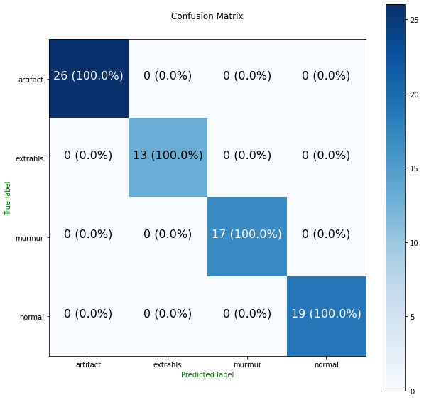

### Heart Beat Sound Classification (HBSC)

🩺♥ Heart Beat Sound Classification (HBSC) is a GraphQL API for classifying heart beats sounds in real time.

<p align="center">
    
</p>

<p align="center">
<a href="https://github.com/crispengari/HBSC/actions/workflows/CI.yml"></a>
<a href="/LICENSE"></a>
</p>

### Getting started

To test this server locally you first need to clone this repository by running the following command:

```shell
git clone https://github.com/CrispenGari/HBSC.git
```

Then:

```shell
cd HBSC/server
```

Then you need to install the packages that were used in this project. First you need to create and activate the virtual environment by running the following command:

```shell
virtualenv venv && .\venv\Scripts\activate.bat
```

Then install the packages

```shell
pip install -r requirements.txt
```

Now you can run the server which is configured using `uvicorn` and `ariadne` by running the following command:

```shell
python app.py
```

The server will start on a default port of `3001` which you can configure by opening the `app.py` file and change the `AppConfig` that looks as follows:

```py
class AppConfig:
    PORT = 3001
    INFO = 'info'
```

You can change the `PORT` number if you want. But when the server is running you can test the `API` at `http://localhost:3001` using different Clients.

### Testing the API using `cURL`

If you navigate to the `audios` folder where I have `4` different audios from different classes. To test the api using `cURL` you run a graphql mutation which looks as follows:

```shell

curl http://localhost:3001 -F operations='{ "query": "mutation ClassifyHeartBeatSound($input: HeatBeatSoundInput!) { classifyHeatBeatSound(input: $input) { error { field message } ok prediction { topPrediction {  label confidence className } predictions {  label confidence className } } } }", "variables": { "input": {"audio": null} } }'  -F map='{ "0": ["variables.input.audio"] }'  -F 0=@artifact.wav
```

If everything went well you will get the following response from the server:

```json
{
  "data": {
    "classifyHeatBeatSound": {
      "error": null,
      "ok": true,
      "prediction": {
        "topPrediction": {
          "label": 0,
          "confidence": 0.9800000190734863,
          "className": "artifact"
        },
        "predictions": [
          {
            "label": 0,
            "confidence": 0.9800000190734863,
            "className": "artifact"
          },
          {
            "label": 1,
            "confidence": 0.009999999776482582,
            "className": "extrahls"
          },
          {
            "label": 2,
            "confidence": 0.009999999776482582,
            "className": "murmur"
          },
          { "label": 3, "confidence": 0.0, "className": "normal" }
        ]
      }
    }
  }
}
```

### Heart Beat Sound Classification Model

The HBSC model was trained to do basic audio classification on heart beat sounds based on `4` classes which are:

1. artifact
2. extrahls
3. murmur
4. normal

<p align="center">

</p>

### Notebooks

The notebook for model training can be found [here.](https://github.com/CrispenGari/torch-audio/blob/main/01_HEART_BEAT_SOUD_CLASSIFICATION/01_HEART_BEAT_SOUD_CLASSIFICATION.ipynb)

### Data

The data for training this model was obtained from [kaggle](https://www.kaggle.com/datasets/kinguistics/heartbeat-sounds)

### Model Metrics

The following metrics was obtained for the best model after training the model for `200` epochs:

```
+--------------------------------------------+
|    EPOCH: 198/200 saving best model...     |
+------------+-------+----------+------------+
| CATEGORY   |  LOSS | ACCURACY |        ETA |
+------------+-------+----------+------------+
| Training   | 0.084 |    0.977 | 0:00:00.61 |
| Validation | 0.046 |    1.000 |            |
+------------+-------+----------+------------+
```

### Classification Report Summary

The following table shows the summary of the classification report for the heart beat sound classification model training.

```
+------------+------------+-------+----------+------------+
| precision  | precision  |recall | f1-score |    support |
+------------+------------+-------+----------+------------+
| accuracy   |            |       | 100%     |    1495    |
+------------+------------+-------+----------+------------+
| macro avg  |    100%    |   100%| 100%     |    1495    |
+------------+------------+-------+----------+------------+
|weighted avg|    100%    |   100%| 100%     |    1495    |
+------------+------------+-------+----------+------------+
```

### Confusion Matrix

The following plot shows the confusion matrix that we obtained after training the model for `200` epochs on the test data.

<p align="center">

</p>

### License

This project is using the `MIT` LICENSE which reads as follows:

```
MIT License

Copyright (c) 2022 crispengari

Permission is hereby granted, free of charge, to any person obtaining a copy
of this software and associated documentation files (the "Software"), to deal
in the Software without restriction, including without limitation the rights
to use, copy, modify, merge, publish, distribute, sublicense, and/or sell
copies of the Software, and to permit persons to whom the Software is
furnished to do so, subject to the following conditions:

The above copyright notice and this permission notice shall be included in all
copies or substantial portions of the Software.

THE SOFTWARE IS PROVIDED "AS IS", WITHOUT WARRANTY OF ANY KIND, EXPRESS OR
IMPLIED, INCLUDING BUT NOT LIMITED TO THE WARRANTIES OF MERCHANTABILITY,
FITNESS FOR A PARTICULAR PURPOSE AND NONINFRINGEMENT. IN NO EVENT SHALL THE
AUTHORS OR COPYRIGHT HOLDERS BE LIABLE FOR ANY CLAIM, DAMAGES OR OTHER
LIABILITY, WHETHER IN AN ACTION OF CONTRACT, TORT OR OTHERWISE, ARISING FROM,
OUT OF OR IN CONNECTION WITH THE SOFTWARE OR THE USE OR OTHER DEALINGS IN THE
SOFTWARE.

```
